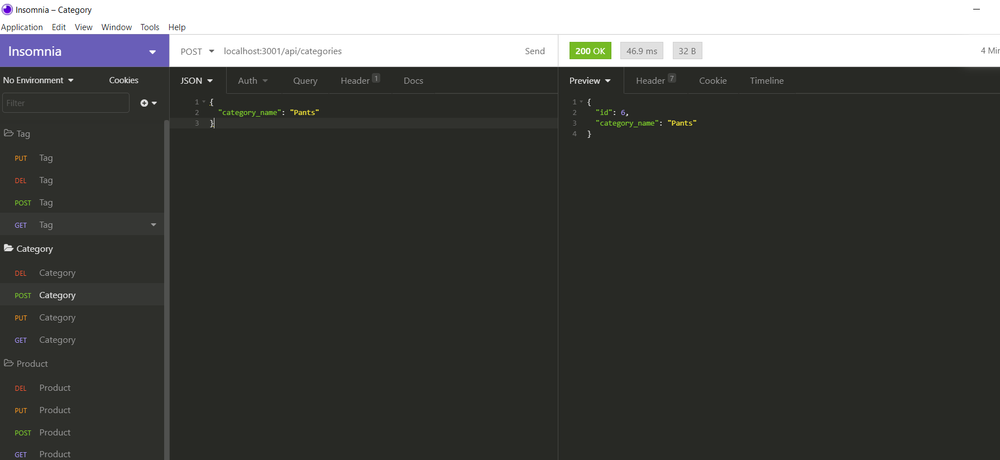
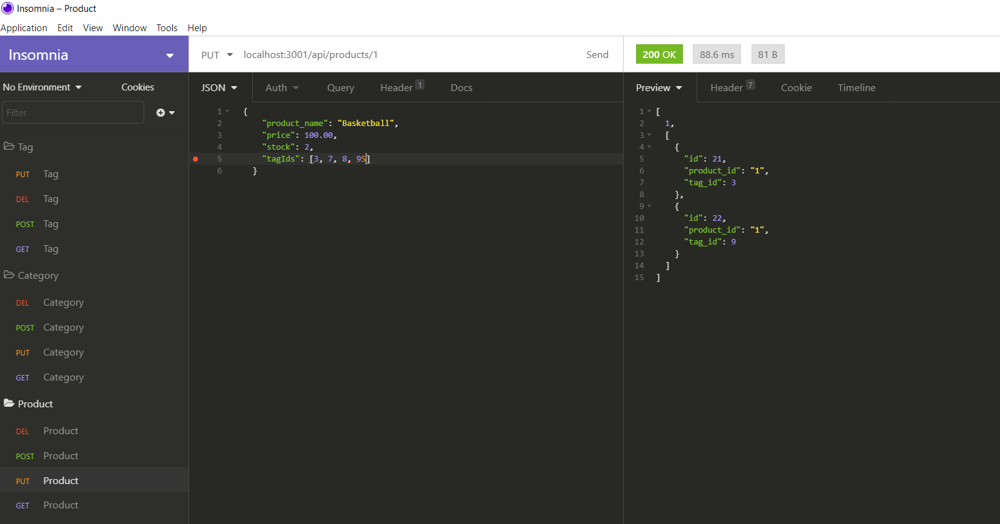
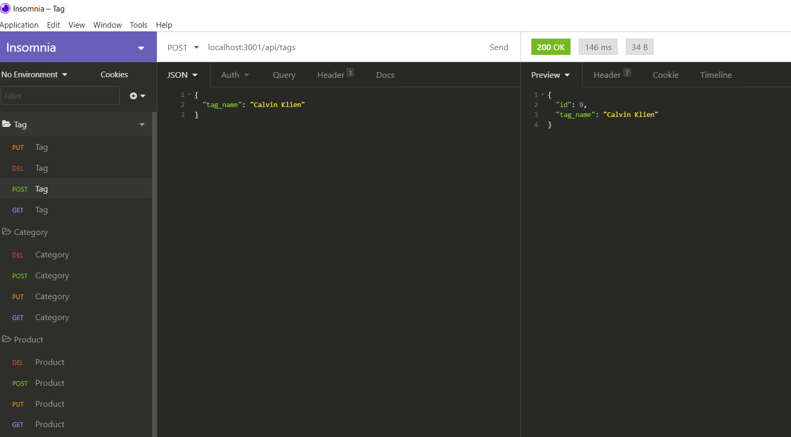
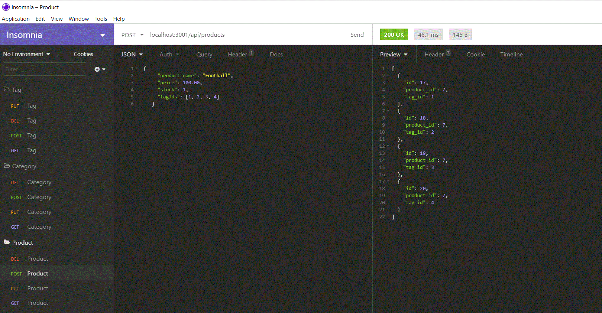

# 13 Object-Relational Mapping (ORM): E-Commerce Back End

## User Story

```md
AS A manager at an internet retail company
I WANT a back end for my e-commerce website that uses the latest technologies
SO THAT my company can compete with other e-commerce companies
```
## Table of Contents:

 * [Installation](#Installation)
 * [Guithub](#Github)
 * [Usage](#Usage)
 * [Images](#Images)
 * [Contributors](#Contributors)
 * [Video](#Video)
 
 ## Installation:
 inquirer is required to prompt user inputs from command line
 To install the inquirer package, the command to run from command line is npm install. 

## GitHub Link

https://github.com/sishirbhattarai/ecommerce-back-end

## Usage
This is used to manage ecommerce. 

## Images








## Contributors
I am the only contributors.

## Link to the Video
https://drive.google.com/file/d/1_D02D_WPbe1olp7S7kCI5obLMv_GNhrh/view

---

© 2020 Trilogy Education Services, LLC, a 2U, Inc. brand. Confidential and Proprietary. All Rights Reserved.
